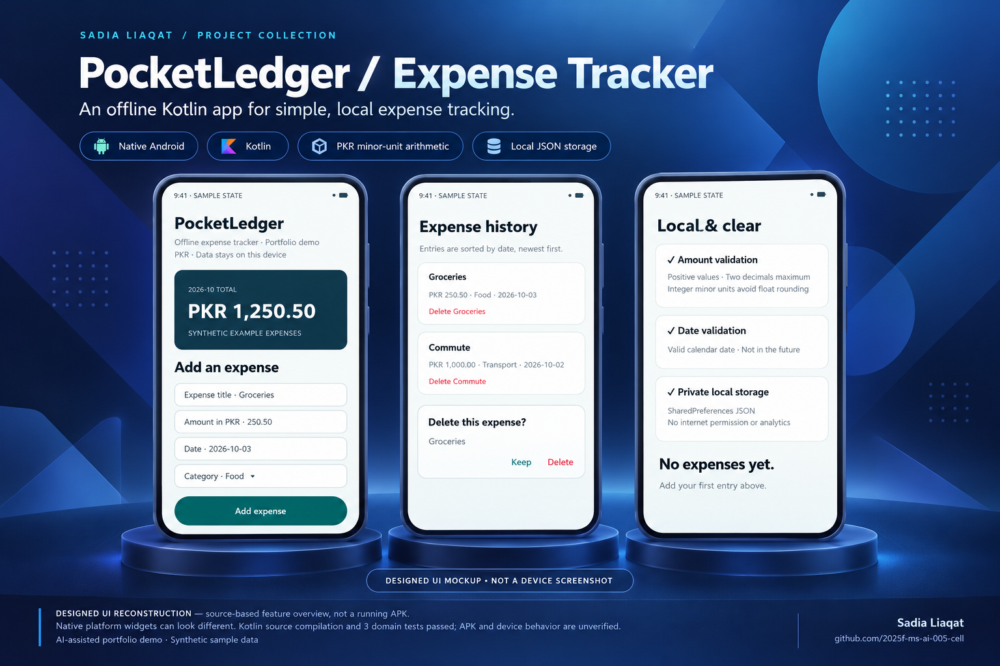

# PocketLedger — Native Android Expense Tracker

AI-assisted Kotlin portfolio demo prepared for **Sadia Liaqat**. Tracks expenses locally with integer minor-unit arithmetic, monthly totals, validation and confirmation before deleting entries. Not a banking product, financial advice, client delivery or production release.

## Features

- Kotlin Android app; platform UI widgets, no external UI libraries.
- PKR amounts stored as integer minor units instead of floating point.
- Title, amount and date validation; categories and date-sorted history.
- Current calendar month total; local JSON persistence in private SharedPreferences.
- Explicit empty state and local-save failure handling.
- No internet permission, backend, analytics or payments; backups disabled.
- JUnit tests for decimal parsing, invalid input and month filtering.

## Visual overview



Designed UI reconstruction based on the Kotlin source with synthetic expenses. **Not a device screenshot or verified APK.** Covers monthly totals, entry validation, local storage and deletion confirmation. The app uses platform widgets; their exact appearance depends on Android's theme.

## Setup and run

Requirements: Android Studio, Android SDK 35, JDK 17+ and Gradle 8.13.

Run `./setup.ps1` on Windows. On macOS/Linux create `src/` and `tests/`, copy `MainActivity.kt` and `Expense.kt` to `src/` and `ExpenseRulesTest.kt` to `tests/`.

Open the repository folder in Android Studio, allow sync, and run on Android 8+ (API 26+). Or with Gradle installed:

```sh
gradle testDebugUnitTest assembleDebug
```

For command-line SDK discovery set `ANDROID_HOME` to your SDK location. Do not commit `local.properties`. Debug APK: `build/outputs/apk/debug/`.

## Structure

Flat source files make the demo easy to inspect; setup places them into Gradle’s configured `src/` and `tests/` directories. `Expense.kt` contains pure domain rules. `MainActivity.kt` implements the platform UI and local JSON persistence. This is a small learning app, not an MVVM/Room/Compose architecture showcase.

## Limitations

Local device storage is not encrypted by this app; avoid entering sensitive real financial data. No export, restore, budget goals or multi-currency support. Large histories use a simple scrolling layout; a Room database and virtualized list would be appropriate next steps. Monthly totals use the device calendar and timezone. Android backup is disabled; uninstalling clears data.

See `VERIFICATION.md` for executed checks; device behavior must be tested before presenting this as a shipped app.

[Sadia’s LinkedIn](https://www.linkedin.com/in/sadia-liaqat-493998398/)

